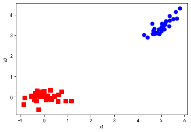

- PCA,主成分分析法:
    1. 通过计算数据矩阵的协方差矩阵，然后得到协方差矩阵的特征值特征向量，选择特征值最大(即方差最大)的k个特征所对应的特征向量组成的矩阵。这样就可以将数据矩阵转换到新的空间当中，实现数据特征的降维。
    2. 不适合稀疏矩阵,稀疏矩阵使用TruncatedSVD.
    3. 其他降维方法,奇异值分解(SVD)、因子分析(FA)、独立成分分析(ICA)。

- FA:因子分析其实就是认为高维样本点实际上是由低维样本点经过高斯分布、线性变换、误差扰动生成的，因此高维数据可以使用低维来表示（本质上就是一种降维算法）。它通过研究众多变量之间的内部依赖关系，探求观测数据中的基本结构，并用少数几个假想变量来表示其基本的数据结构。这几个假想变量能够反映原来众多变量的主要信息。原始的变量是可观测的显在变量，而假想变量是不可观测的潜在变量，称为因子。
- SVD:奇异值分解,SVD 相当于an implementation of PCA,奇异值可以被看作成一个矩阵的代表值，或者说，奇异值能够代表这个矩阵的信息。当奇异值越大时，它代表的信息越多。因此，我们取前面若干个最大的奇异值，就可以基本上还原出数据本身。
- ICA:独立成分分析,适合用于"源"成分是独立的.


```python
import numpy as np
import pandas as pd
import matplotlib.pyplot as plt  #2D绘图库
```


```python
#计算均值,要求输入数据为numpy的矩阵格式，行表示样本数，列表示特征
def meanX(dataX):
    return np.mean(dataX,axis=0)#axis=0表示按照列来求均值，如果输入list,则axis=1

def pca(XMat, k):
    average = meanX(XMat)
    m, n = np.shape(XMat)
    data_adjust = []
    avgs = np.tile(average, (m, 1))
    data_adjust = XMat - avgs
    covX = np.cov(data_adjust.T)   #计算协方差矩阵
    featValue, featVec=  np.linalg.eig(covX)  #求解协方差矩阵的特征值和特征向量
    index = np.argsort(-featValue) #按照featValue进行从大到小排序
    finalData = []
    if k > n:
        print ("k must lower than feature number")
        return
    else:
        #注意特征向量时列向量，而numpy的二维矩阵(数组)a[m][n]中，a[1]表示第1行值
        selectVec = np.matrix(featVec.T[index[:k]]) #所以这里需要进行转置
        finalData = data_adjust * selectVec.T
        reconData = (finalData * selectVec) + average
    return finalData, reconData

#输入文件的每行数据都以\t隔开
def loaddata(datafile):
    return np.array(pd.read_csv(datafile,sep=" ",header=None)).astype(np.float)

def plotBestFit(data1, data2):
    dataArr1 = np.array(data1)
    dataArr2 = np.array(data2)

    m = np.shape(dataArr1)[0]
    axis_x1 = []
    axis_y1 = []
    axis_x2 = []
    axis_y2 = []
    for i in range(m):
        axis_x1.append(dataArr1[i,0])
        axis_y1.append(dataArr1[i,1])
        axis_x2.append(dataArr2[i,0])
        axis_y2.append(dataArr2[i,1])
    fig = plt.figure()
    ax = fig.add_subplot(111)
    ax.scatter(axis_x1, axis_y1, s=50, c='red', marker='s')
    ax.scatter(axis_x2, axis_y2, s=50, c='blue')
    plt.xlabel('x1'); plt.ylabel('x2');
    plt.savefig("outfile.png")
    plt.show()
    
#根据数据集data.txt
def main():
    datafile = "data.txt"
    XMat = loaddata(datafile)
#     print(XMat)
    k = 2
    return pca(XMat, k)
```


```python
finalData, reconMat = main()
plotBestFit(finalData, reconMat)
```

    [[5.1 3.5 1.4 0.2]
     [4.9 3.  1.4 0.2]
     [4.7 3.2 1.3 0.2]
     [4.6 3.1 1.5 0.2]
     [5.  3.6 1.4 0.2]
     [5.4 3.9 1.7 0.4]
     [4.6 3.4 1.4 0.3]
     [5.  3.4 1.5 0.2]
     [4.4 2.9 1.4 0.2]
     [4.9 3.1 1.5 0.1]
     [5.4 3.7 1.5 0.2]
     [4.8 3.4 1.6 0.2]
     [4.8 3.  1.4 0.1]
     [4.3 3.  1.1 0.1]
     [5.8 4.  1.2 0.2]
     [5.7 4.4 1.5 0.4]
     [5.4 3.9 1.3 0.4]
     [5.1 3.5 1.4 0.3]
     [5.7 3.8 1.7 0.3]
     [5.1 3.8 1.5 0.3]
     [5.4 3.4 1.7 0.2]
     [5.1 3.7 1.5 0.4]
     [4.6 3.6 1.  0.2]
     [5.1 3.3 1.7 0.5]
     [4.8 3.4 1.9 0.2]
     [5.  3.  1.6 0.2]
     [5.  3.4 1.6 0.4]
     [5.2 3.5 1.5 0.2]
     [5.2 3.4 1.4 0.2]
     [4.7 3.2 1.6 0.2]
     [4.8 3.1 1.6 0.2]]





```python
def loaddata1(datafile): # 加载自己的数据
    return np.array(pd.read_excel(datafile,header=None)).astype(np.float)
mydata = loaddata1('result2.xlsx')
```


```python
# scikit-learn工具包的PCA案例
import matplotlib.pyplot as plt

from sklearn import datasets
# PCA替换成TruncatedSVD,可以处理稀疏数据集
from sklearn.decomposition import TruncatedSVD,PCA
from sklearn.discriminant_analysis import LinearDiscriminantAnalysis

iris = datasets.load_iris() # 加载紫鹫花数据集

X = mydata # 数据
y = iris.target # 类别代表的数字
target_names = iris.target_names # 类别

pca = TruncatedSVD(n_components=3) #选择降低的维度,现在是从5降到3
X_r = pca.fit(X).transform(X)
X_r # TruncatedSVD结果
```


    array([[ 0.7551883 , -0.00400871,  0.05932355],
           [ 0.75504775, -0.00404967, -0.00149182],
           [ 0.75504889, -0.00404927, -0.00105552],
           ...,
           [ 0.9999832 , -0.00536337, -0.00217085],
           [ 0.75504754, -0.00404966, -0.00163886],
           [ 0.75504754, -0.00404966, -0.00163886]])


```python
mydata
```


    array([[6.62420382e-02, 7.32511293e-04, 7.55060210e-01, 1.07607453e-04,
            0.00000000e+00],
           [0.00000000e+00, 3.66255646e-04, 7.55060210e-01, 1.07607453e-04,
            0.00000000e+00],
           [6.36942675e-04, 0.00000000e+00, 7.55060210e-01, 1.07607453e-04,
            0.00000000e+00],
           ...,
           [0.00000000e+00, 0.00000000e+00, 1.00000000e+00, 0.00000000e+00,
            0.00000000e+00],
           [0.00000000e+00, 0.00000000e+00, 7.55060210e-01, 1.07607453e-04,
            0.00000000e+00],
           [0.00000000e+00, 0.00000000e+00, 7.55060210e-01, 1.07607453e-04,
            0.00000000e+00]])


```python
pd.DataFrame(X_r).to_csv('TruncatedSVD_result.txt',header = False,index = False)
```


```python

```
