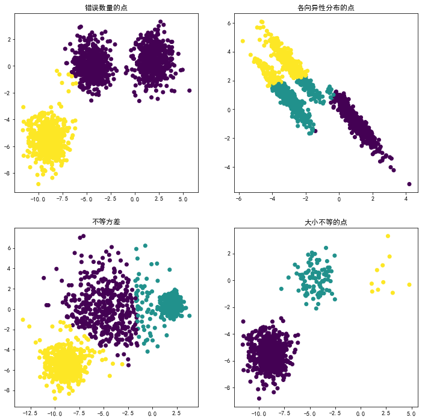

```python
import numpy as np
import matplotlib.pyplot as plt

from sklearn.cluster import KMeans
from sklearn.datasets import make_blobs

plt.figure(figsize=(12, 12))

n_samples = 1500
random_state = 170
# 生成各向同性的高斯斑点以进行聚类。
X, y = make_blobs(n_samples=n_samples, random_state=random_state)

# Incorrect number of clusters
y_pred = KMeans(n_clusters=2, random_state=random_state).fit_predict(X)

plt.subplot(221)
plt.scatter(X[:, 0], X[:, 1], c=y_pred)
plt.title("数量不同的点")

# Anisotropicly distributed data
transformation = [[0.60834549, -0.63667341], [-0.40887718, 0.85253229]]
X_aniso = np.dot(X, transformation)
y_pred = KMeans(n_clusters=3, random_state=random_state).fit_predict(X_aniso)

plt.subplot(222)
plt.scatter(X_aniso[:, 0], X_aniso[:, 1], c=y_pred)
plt.title("各向异性分布的点")

# Different variance
X_varied, y_varied = make_blobs(n_samples=n_samples,
                                cluster_std=[1.0, 2.5, 0.5],
                                random_state=random_state)
y_pred = KMeans(n_clusters=3, random_state=random_state).fit_predict(X_varied)

plt.subplot(223)
plt.scatter(X_varied[:, 0], X_varied[:, 1], c=y_pred)
plt.title("不等方差")

# Unevenly sized blobs
X_filtered = np.vstack((X[y == 0][:500], X[y == 1][:100], X[y == 2][:10]))
y_pred = KMeans(n_clusters=3,
                random_state=random_state).fit_predict(X_filtered)

plt.subplot(224)
plt.scatter(X_filtered[:, 0], X_filtered[:, 1], c=y_pred)
plt.title("大小不等的点")

plt.show()
```





```python
import pandas as pd
import numpy as np
from sklearn.cluster import KMeans
from sklearn import metrics

import pandas as pd
# plt.figure(figsize=(12, 12))
X = pd.read_csv('TruncatedSVD_result.txt',header = None)
#假如我要构造一个聚类数为5的聚类器
estimator = KMeans(n_clusters=5)
y_pred = estimator.fit_predict(X)
y_pred
```


    array([1, 1, 1, ..., 0, 1, 1], dtype=int32)


```python
# for i in range(y_pred.size):
#     if y_pred[i] == 4:
#         print(i)
# 0,1,2,3,4 分别代表五级,四级,三级,二级,一级(最高)危害
```


```python
r1 = pd.Series(estimator.labels_).value_counts()  #统计各个类别的数目
r2 = pd.DataFrame(estimator.cluster_centers_)     #找出聚类中心
r = pd.concat([r2, r1], axis = 1) #横向连接（0是纵向），得到聚类中心对应的类别下的数目
r.columns = list(X.columns) + [u'类别数目'] #重命名表头
print(r)
print("轮廓系数：", metrics.silhouette_score(X, estimator.labels_, metric='euclidean'))
```

              0         1         2   类别数目
    0  0.999992 -0.004854  0.000356  12925
    1  0.755053 -0.003695 -0.000148  66815
    2  0.790402  0.600511  0.000126    689
    3  0.666659 -0.003534  0.000074  33145
    4  0.331172  0.000325  0.009868    609
    轮廓系数： 0.9698284505528871


```python
import pandas as pd
import numpy as np
from sklearn.cluster import KMeans
from sklearn import metrics
 
#假如我要构造一个聚类数为5的聚类器
estimator = KMeans(n_clusters=5, random_state=777)#构造聚类器,设定随机种子
estimator.fit(X)#聚类
 
r1 = pd.Series(estimator.labels_).value_counts()  #统计各个类别的数目
r2 = pd.DataFrame(estimator.cluster_centers_)     #找出聚类中心
r = pd.concat([r2, r1], axis = 1) #横向连接（0是纵向），得到聚类中心对应的类别下的数目
r.columns = list(X.columns) + [u'类别数目'] #重命名表头
print(r)
print("轮廓系数：", metrics.silhouette_score(X, estimator.labels_, metric='euclidean'))
```

                  0             1          2    类别数目
    0  9.806883e+12  37463.957973   4.201691  113316
    1  3.291085e+17  30279.583046  44.132517     250
    2  4.078982e+17 -20854.146711  45.826271     299
    3  8.887881e+16  37017.442535  14.181359     158
    4  2.270144e+17    343.575948  33.727194     160
    轮廓系数： 0.996401559363056


```python

```
