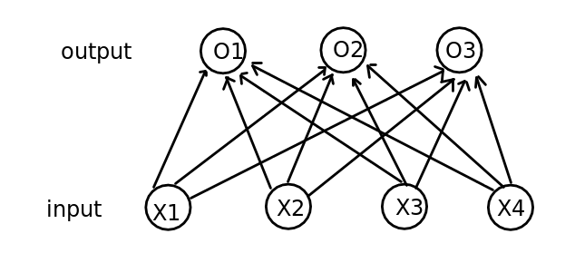

# softmax回归

- softmax回归是一个解决分类问题的模型

- softmax是一个单层的全连接的神经网络模型

- 任务：将图片进行分类

- 假设我们有4个特征，3个输出，这里的输出的含义是：图片一共有三个类别，每个输出的值分别代表该类别的可能性，如$O_1 = 0.5$，$O_2 = 3$，$O_3 = 20$，则说明该图片为3类别的可能性最大

- 公式
  $$
  o_1 = x_1w_{11} + x_2w_{21} + x_3w_{31} + x_4w_{41} + b_1 \\
  o_2 = x_1w_{12} + x_2w_{22} + x_3w_{32} + x_4w_{42} + b_2 \\
  o_3 = x_1w_{13} + x_2w_{23} + x_3w_{33} + x_4w_{43} + b_3
  $$
  

## softmax运算

- softmax运算将预测值映射到0和1之间，并取其中的最大值
  $$
  \hat{y_1} , \hat{y_2}, \hat{y_3} = softmax(o_1, o_2, o_3) \\
    softmax(o_i) = \frac {exp(o_i)} {\sum_{i=1}^3exp(o_i)} \\
    argmax \pmb{o_i} = argmax\pmb{y_i}
  $$
  

- softmax运算所做的事情，只是将结果映射到0-1中


## 单个样本的矢量计算

- 设我们的权重和参数矩阵分别为：

$$
W = \left[
   		\begin{matrix}
   			W_{11} & W_{12} & W_{13} \\
   			W_{21} & W_{22} & W_{23} \\
   			W_{31} & W_{32} & W_{33} \\
   			W_{41} & W_{42} & W_{43}
   		\end{matrix}
   \right] \tag{4*3} \\
b = \left[
			b_1,b_2,b_3
	\right]
$$

- 假设每个样本都是2*2像素的图片，也就是有4个像素点
  $$
  {x^{(i)}} = [x^{(i)}_1, x^{(i)}_2,x^{(i)}_3,x^{(i)}_4]
  $$
  

- 输出就为：
  $$
  \hat{y}^{(i)} = [y^{(i)}_1, y^{(i)}_2, y^{(i)}_3]
  $$
  

- 整个计算过程为：
  $$
  o^{(i)} = x^{(i)}W + b \\
  \hat{y}^{(i)} = softmax(o^{(i)})
  $$
  

  

## 小批量

- 每次选取测试集中的一部分来做训练


## 交叉熵(cross-entropy)损失函数

- 交叉熵公式
  $$
  H(y^{(i)}, \hat{y}^{(i)}) = -\sum_{j=1}^qy^{(j)}_j\pmb{log}\hat{y}^{(i)}_j
  $$

- 通过这个公式我们知道，$y^{(i)}$只有第$y^{(i)}_{y(i)}$为1，其余都为0，简化以后为：
  $$
  H(y^{(i)},\hat{y}^{(i)}) = -log\hat{y}^{(i)}_{y^{(i)}}
  $$

- 交叉熵损失函数（交叉熵求和取平均值）
  $$
  l(\theta) = \frac{1}{n}\sum_{i=1}^nH(y^{(i)}, \hat{y}^{(i)})
  $$

- 我们要做的就是让$l(\theta)$最小，下面作出一系列等价
  $$
  l(\theta) = \frac{1}{n}\sum_{i=1}^nH(y^{(i)}, \hat{y}^{(i)}) \\
  <=> nl(\theta) = \sum_{i=1}^nH(y^{(i)}, \hat{y}^{(i)}) \\
  <=> -nl(\theta) = -\sum_{i=1}^nH(y^{(i)}, \hat{y}^{(i)}) \\
  <=> exp(-nl(\theta)) = exp(-\sum_{i=1}^nH(y^{(i)}, \hat{y}^{(i)})) \\
  我们要最小化l(\theta)，就等价于要让exp(-nl(\theta))最大，也就是让exp(-\sum_{i=1}^nH(y^{(i)}, \hat{y}^{(i)}))最大 \\
  exp(-\sum_{i=1}^nH(y^{(i)}, \hat{y}^{(i)})) = exp(-\sum_{i=1}^n-log\hat{y}^{(i)}_{y^{(i)}}) \\
  = exp(\sum_{i=1}^nlog\hat{y}^{(i)}_{y^{(i)}}) \\
  = \prod_{i=1}^{n}\hat{y}^{(i)}_{y^{(i)}}
  $$
  

- 因此最小化$l(\theta)$就相当于在最大化$\prod_{i=1}^{n}\hat{y}^{(i)}_{y^{(i)}}$，翻译成中文就是**最小化交叉熵损失函数**等价于**最大化训练数据集所有标签类别的联合预测概率**

## 代码

```python
# 假设我们的图像是28*28的，那么一个共有28*28 = 784个特征

# 初始化
# 输入特征784个
num_inputs = 784
# 输出10个类别的值
num_ouputs = 10
# 初始化W和b
W = nd.random.normal(scale=0.01, shape=(num_inputs, num_outputs))
b = nd.zeros(num_outputs)

# 为模型附上梯度
W.attach_grad()
b.attach_grad()

# 实现softmax运算
def softmax(X):
	X_exp = X.exp()
    # 求每个输出的总和
    partition = X_exp.sum(axis=1, keepdims=True)
    return X_exp / partition

# 定义模型
def net(X):
    # 这里X.reshape((-1,x)) 是将X变为一维的向量
    return softmax(nd.dot(X.reshape((-1, num_inputs)), W) + b)

# 定义损失函数
def cross_entropy(y_hat,y):
    return -nd.pick(y_hat,y).log()

# 定义在正确率函数
def accuracy(y_hat, y):
    return (y_hat.argmax(axis=1) == y.astype('float32')).mean().asscalar()

# 评价函数 
# 这里的data_iter应该是测试集test_iter
def evaluate_accuracy(data_iter, net):
    acc_sum, n = 0.0, 0
    for X,y in data_iter:
        y = y.astype('float32')
        acc_sum += (net(X).argmax(axis=1) == y).mean().asscalar()
        n += y.size
    return acc_sum / n

# 训练模型
# 定义迭代周期和学习率
num_epochs , lr = 5, 0.1
def train_ch3(net, train_iter, test_iter, loss, num_epochs, batch_size, params=None, lr=None, trainer=None):
    for epoch in range(num_epochs):
        #train_loss_sum, train_accuracy_sum
        train_l_sum, train_acc_sum, n = 0.0, 0.0, 0
        for X,y in train_iter:
            with autograd.record():
                y_hat = net(X)
                l = loss(y_hat, y).sum()
            l.backward()
            if trainer is None:
                d2l.sgd(params, lr, batch_size)
            else:
                trainer.step(batch_size)
            y = y.astype('float32')
            train_l_sum += l.asscalar()
            train_acc_sum += (y_hat.argmax(axis=1) == y).sum().asscalar()
            n += y.size
        test_acc = evaluate_accuracy(test_iter, net)
        print('epoch {},loss {},train accuracy {}, test accuracy {}'.format(epoch+1, train_l_sum / n,train_acc_sum / n, test_acc))
```

